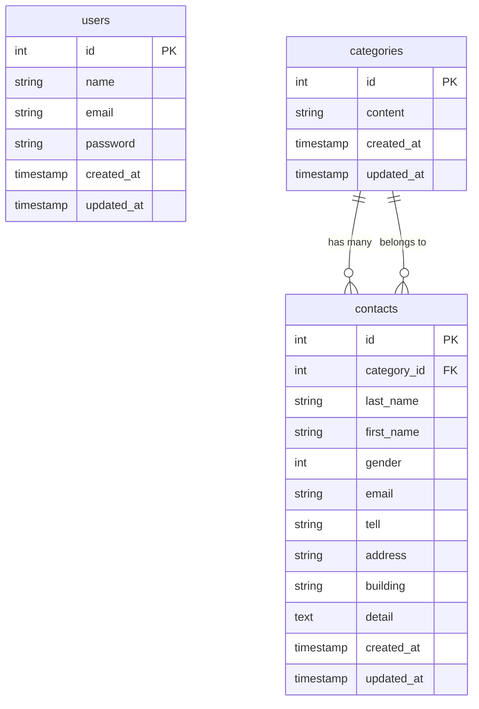

# お問い合わせ管理システム

## 概要

Laravel 8.x を使用したお問い合わせフォームと管理システムです。ユーザーからのお問い合わせを受け付け、管理者が一覧表示・検索・詳細確認を行うことができます。

## 使用技術(実行環境)

### バックエンド

- **PHP**: 8.1
- **Laravel**: 8.75

### フロントエンド

- **HTML/CSS**: レスポンシブデザイン対応
- **JavaScript**: フォーム操作・バリデーション・モーダル表示・ページネーション

### データベース

- **MySQL**: 8.0.26

### インフラ・ツール

- **Docker**: コンテナ化環境
- **Nginx**: 1.21.1 (Web サーバー)
- **PHPMyAdmin**: データベース管理ツール

## 環境構築

### 前提条件

- Docker
- Docker Compose

### 1. リポジトリのクローン

```bash
git clone [https://github.com/yusuke-yano-01/confirmation-test.git]
cd confirmation-test
```

### 2. Docker コンテナのビルド・起動

```bash
# コンテナのビルドと起動
docker-compose up -d --build
```

### 3. 依存関係のインストール

```bash
# PHPコンテナに入る
docker-compose exec php bash

# Composerで依存関係をインストール
composer install
```

### 4. 環境設定ファイルの作成

```bash
# .envファイルをコピー
cp .env.example .env

# アプリケーションキーの生成
php artisan key:generate
```

### 5. データベースの設定

`.env`ファイルでデータベース接続情報を設定：

```env
DB_CONNECTION=mysql
DB_HOST=mysql
DB_PORT=3306
DB_DATABASE=laravel_db
DB_USERNAME=laravel_user
DB_PASSWORD=laravel_pass
```

### 6. データベースマイグレーション

```bash
# マイグレーションの実行
php artisan migrate

# シーダーの実行（サンプルデータの投入）
php artisan db:seed

# マイグレーションの状態確認
php artisan migrate:status

# マイグレーションのロールバック（必要に応じて）
php artisan migrate:rollback

# 全マイグレーションのリセット（開発環境のみ）
php artisan migrate:fresh --seed
```

### 7. ストレージディレクトリの権限設定

```bash
# ストレージディレクトリの権限を設定
chmod -R 777 storage
chmod -R 777 bootstrap/cache
```

## ER 図



### フィールド詳細

#### users テーブル

- 管理者ユーザー情報を管理
- 認証・認可に使用

#### categories テーブル

- お問い合わせ内容の種類を管理
- 例：「商品について」「サービスについて」「その他」

#### contacts テーブル

- お問い合わせ情報を管理
- `category_id` で categories テーブルと関連付け
- `gender` は数値で管理（1:男性、2:女性、3:その他）

## URL

### 開発環境

- **メインサイト**: http://localhost/
- **お問い合わせフォーム**: http://localhost/contactform
- **お問い合わせ一覧**: http://localhost/contactlist
- **認証ページ**: http://localhost/auth/login
- **PHPMyAdmin**: http://localhost:8080

### データベース接続情報

- **ホスト**: localhost
- **ポート**: 3306
- **データベース名**: laravel_db
- **ユーザー名**: laravel_user
- **パスワード**: laravel_pass

## 主な機能

### お問い合わせフォーム

- ユーザー情報入力（氏名、性別、メールアドレス等）
- お問い合わせ内容の種類選択
- 詳細内容の入力
- 確認画面での内容確認
- 完了画面での受付完了

### お問い合わせ管理

- お問い合わせ一覧表示
- 検索機能（メールアドレス、性別、カテゴリ、登録日）
- 詳細表示（モーダルウィンドウ）
- リセット機能（検索条件のクリア）
- CSV エクスポート機能
- ページネーション機能（カスタムデザイン）

### 認証機能

- ユーザー登録
- ログイン・ログアウト
- パスワードリセット

## ディレクトリ構造

```
confirmation-test/
├── docker/                 # Docker設定ファイル
│   ├── mysql/             # MySQL設定
│   ├── nginx/             # Nginx設定
│   └── php/               # PHP設定
├── src/                   # Laravelアプリケーション
│   ├── app/               # アプリケーションロジック
│   ├── database/          # データベース関連
│   ├── public/            # 公開ファイル
│   ├── resources/         # ビュー・アセット
│   └── routes/            # ルート定義
├── docker-compose.yml     # Docker Compose設定
└── README.md             # このファイル
```
